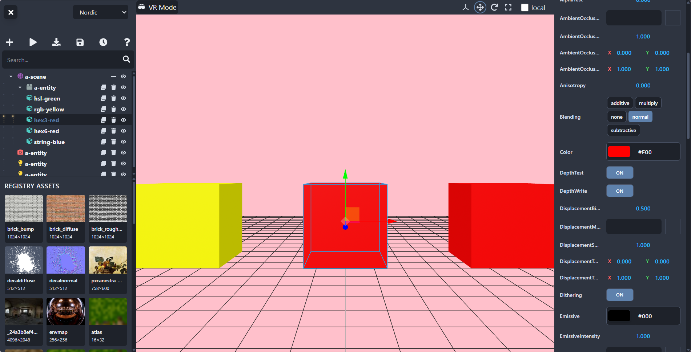

# 🦄 A-Frame Engine
A-Frame Engine modernizes the aframe-inspector/editor to be competitive with modern game engines like Unity, Unreal, or Godot. Features an improved 2D editor experience, full VR editing mode, aframe-watcher sync support, and much more.



# Getting Started
Use a-frame engine in your project today with:
```html
<a-scene inspector="url: https://cdn.jsdelivr.net/gh/foobar404/aframe-engine@main/dist/aframe-engine.min.js"></a-scene>
```

# Features
- **VR editing mode** — edit your scene in full XR with motion controllers
- **Assets panel** — manage `<a-assets>` entries directly in the editor
- **Auto save** — syncs changes via aframe-watcher automatically
- **Fly controls** — navigate the viewport with WASD + mouse
- **All A-Frame primitives** — add any registered primitive from the toolbar dropdown
- **Theme switcher** — 13 built-in themes (Dark, Light, High Contrast, Blue, Purple, Green, Cyberpunk, Warm, Ocean, Nordic, Candy, Gruvbox, Neon Dreams) persisted via localStorage
- **React + Vite** — modernized stack with functional components and Tailwind CSS
- **VR toolbelt** — paint, move, shapes, component, and other VR-native tools

# Keyboard Shortcuts
| Key | Action |
|-----|--------|
| `H` | Open help modal |
| `Esc` | Deselect entity |
| `1` | Translate mode |
| `2` | Rotate mode |
| `3` | Scale mode |
| `F` | Focus selected entity |
| `Ctrl+Z` | Undo |
| `Ctrl+Y` | Redo |
| `Ctrl+D` | Duplicate entity |
| `Delete` | Remove entity |